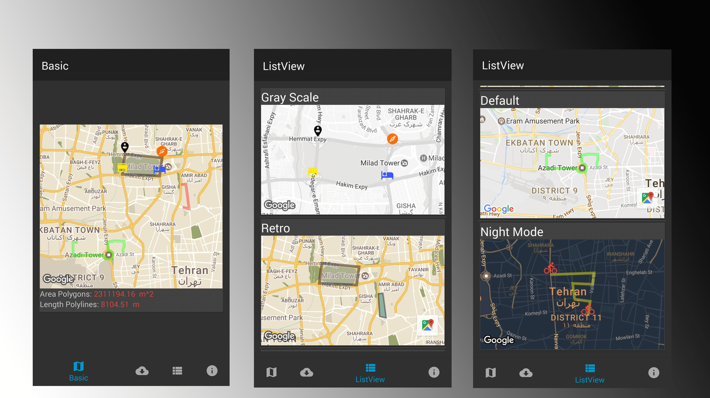

## simple library for handle markers, polygons and polylines on google maps.

[](https://jitpack.io/#bkhezry/ExtraMapUtils)
[](https://android-arsenal.com/details/1/5616)
[](https://travis-ci.org/bkhezry/ExtraMapUtils)

ExtraMapUtils is an android library to make working with map markers, polygon and polyline drawing on googlemaps, more convenient.

**Project Setup and Dependencies**
- JDK 8
- Android SDK Build tools 25.0.2
- Supports API Level +17
- AppCompat & Cardview libraries 25.3.0
- Google Play Services Maps 10.2.0

**Highlights**
- Provides multiple themea to apply on MapView
- Add multiple markers, polygons & polylines easily
- Supports vector drawable for marker icon
- Supports Lite Mode
- Supports calculating `area` of polygon & `length` of polyline
- Supports `GeoJson` & `KML` as layer from url or resource file

# Preview
## Demo
You can download the latest demo APK from here: https://github.com/bkhezry/ExtraMapUtils/blob/master/assets/DemoExtraMapUtils.apk

## Screenshots



# Setup
## 1. Provide the gradle dependency
Add it in your root build.gradle at the end of repositories:
```gradle
allprojects {
	repositories {
		...
		maven { url "https://jitpack.io" }
	}
}
```
Add the dependency:
```gradle
dependencies {
	compile 'com.github.bkhezry:ExtraMapUtils:v1.2.0'
}
```

## 2. Add your code
add MapView to UI layout
```xml
<com.google.android.gms.maps.MapView
	android:id="@+id/mapLite"
	android:name="com.google.android.gms.maps.MapFragment"
	android:layout_width="match_parent"
	android:layout_height="300dp"
	app:liteMode="true"
	app:mapType="normal" />
```
```java
new ViewOptionBuilder()
	.withStyleName(ViewOption.StyleDef.RETRO)
	.withCenterCoordinates(new LatLng(35.6892, 51.3890))
	.withMarkers(AppUtils.getListExtraMarker())
	.withPolygons(
		AppUtils.getPolygon_1()
	)
	.withPolylines(
		AppUtils.getPolyline_2(),
		AppUtils.getPolyline_4()
	)
	.withForceCenterMap(false)
	.build();
```
after declaring the ViewOption, add this code for showing elements on the MapView
```java
 MapUtils.showElements(viewOption, googleMap, getActivity());
 ```
 
## ViewOption attributes

| Name | Type | Default | Description |
|:----:|:----:|:-------:|:-----------:|
|title|String|@NullAble| use in demo as CardView tile |
|centerLatLng|LatLng|@NullAble| center of Map |
|forceCenterMap|boolean|false| force map moving to centerLatLng point |
|mapsZoom|float|14| zoom of map when map moving to centerLatLng |
|markers|ExtraMarker|@NullAble| list of ExtraMarker that showing on Map |
|polygons|ExtraPolygon|@NullAble| list of ExtraPolygon that showing on Map |
|polylines|ExtraPolyline|@NullAble| list of ExtraPolyline that showing on Map |
|isListView|boolean|false| when using utils in ListView this parameter should be true. because fixing zoom of bounded map |
|styleName|StyleDef|DEFAULT| style of google map |

### declare ExtraMarker
```java
new ExtraMarkerBuilder()
	.setName("Start")
	.setCenter(latLngs_3[0])
	.setIcon(icons_2[0])
	.build()
```		
## ExtraMarker attributes

| Name | Type | Default | Description |
|:----:|:----:|:-------:|:-----------:|
|name|String|@NullAble| label of Marker |
|center|LatLng|@NoneNull| center of Marker |
|icon|int|@NoneNull| icon of marker |

### delare ExtraPolygon
```java
new ExtraPolygonBuilder()
	.setPoints(latLngs_1)
	.setzIndex(0)
	.setStrokeWidth(10)
	.setStrokeColor(Color.argb(100, 0, 0, 0))
	.setFillColor(Color.argb(100, 200, 200, 200))
	.build();
```
## ExtraPolygon attributes
| Name | Type | Default | Description |
|:----:|:----:|:-------:|:-----------:|
|points|LatLang[]|@NoneNull| list of point |
|fillColor|int|none color| color of polygon filling |
|uiOptions|UiOption|@NoneNull|some parameter of polygon |

### declare ExtraPolyline
```java
 new ExtraPolylineBuilder()
                .setPoints(latLngs_2)
                .setzIndex(0)
                .setStrokeWidth(10)
                .setStrokeColor(Color.argb(100, 255, 0, 0))
                .build();
```	
## ExtraPolyline attributes
| Name | Type | Default | Description |
|:----:|:----:|:-------:|:-----------:|
|points|LatLang[]|@NoneNull| list of point |
|uiOptions|UiOption|@NoneNull|some parameter of polyline |


## UiOption attributes
| Name | Type | Default | Description |
|:----:|:----:|:-------:|:-----------:|
|strokeColor|int|Color.BLACK| line color |
|strokeWidth|int|10|width of line |
|zIndex|int|0|zIndex of polyline or polygon |
|strokePattern|StrokePatternDef|Default| stroke pattern of line|

 **getArea()** method in ExtraPolygon return Area of polygon in square meters.
 **getLength** method in ExtraPolyline return Length of polyline in meters.
 
## add GeoJson to ViewOption
```java
new ViewOptionBuilder()
	    .withTitle("GeoJson")
	    .withGeoJson(context.getString(R.string.geo_json_url))
	    .withStyleName(ViewOption.StyleDef.DEFAULT)
	    .withGeoJsonEventListener(new onGeoJsonEventListener() {
		@Override
		public void onFeatureClick(Feature feature) {
		    //Do more things.
		}

		@Override
		public void onGeoJsonLoaded(GeoJsonLayer geoJsonLayer) {
		    AppUtils.addColorsToMarkers(geoJsonLayer);
		}
	    })
	    .withIsListView(true)
	    .build();
```	    
## Todo

 - [ ] clustering support for markers
 - [x] add GeoJson & KML layers to map
 - [ ] add more demo for mixed elements.
 - [ ] javadoc
 * ...
 
# Developed By

* Behrouz Khezry
 * [@bkhezry](https://twitter.com/bkhezry) 


# License

    Copyright 2017 Behrouz Khezry

    Licensed under the Apache License, Version 2.0 (the "License");
    you may not use this file except in compliance with the License.
    You may obtain a copy of the License at

       http://www.apache.org/licenses/LICENSE-2.0

    Unless required by applicable law or agreed to in writing, software
    distributed under the License is distributed on an "AS IS" BASIS,
    WITHOUT WARRANTIES OR CONDITIONS OF ANY KIND, either express or implied.
    See the License for the specific language governing permissions and
    limitations under the License.
