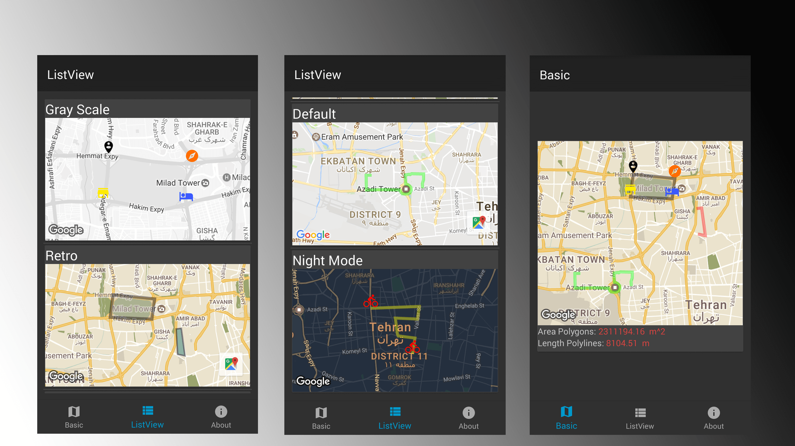
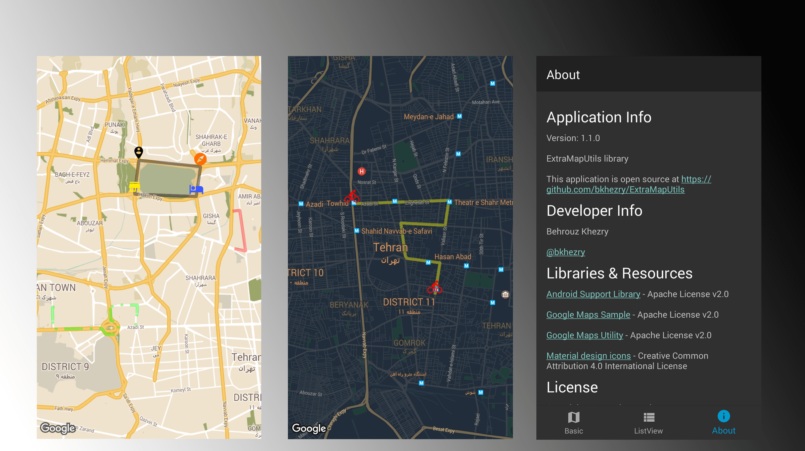

## simple library for handle markers, polygons and polylines on google maps.

**Requirements**
- JDK 8
- Android SDK Build tools 25.0.2
- Android SDK 25
- Android Support Repository
- Android Support Library 25.3.0

**A quick overview**
- compatible with **API Level 17**
- provide multiple theme for google maps
- add multiple markers, polygons & polylines in simple way
- support Vector drawable for marker icon
- provide demo of using library in ListView
- lite mode supported

# Preview
## Demo
You can download the latest demo APK from here: https://github.com/bkhezry/ExtraMapUtils/blob/master/assets/DemoExtraMapUtils.apk

## Screenshots



# Setup
## 1. Provide the gradle dependency
Add it in your root build.gradle at the end of repositories:
```gradle
allprojects {
	repositories {
		...
		maven { url "https://jitpack.io" }
	}
}
```
Add the dependency:
```gradle
dependencies {
	compile 'com.github.bkhezry:ExtraMapUtils:1.1.0'
}
```

# more step will be add...

# Developed By

* Behrouz Khezry
 * [@bkhezry](https://twitter.com/bkhezry) 


# License

    Copyright 2017 Behrouz Khezry

    Licensed under the Apache License, Version 2.0 (the "License");
    you may not use this file except in compliance with the License.
    You may obtain a copy of the License at

       http://www.apache.org/licenses/LICENSE-2.0

    Unless required by applicable law or agreed to in writing, software
    distributed under the License is distributed on an "AS IS" BASIS,
    WITHOUT WARRANTIES OR CONDITIONS OF ANY KIND, either express or implied.
    See the License for the specific language governing permissions and
    limitations under the License.
